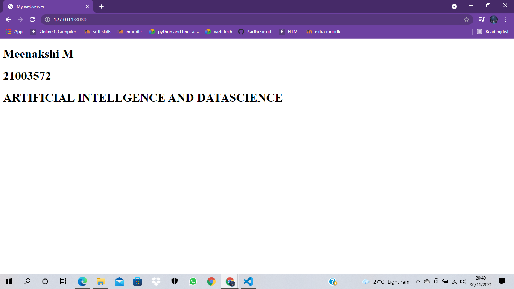

# Developing a Simple Webserver
## AIM:

To develop a simple webserver to serve html pages.
## DESIGN STEPS:
### Step 1:

HTML content creation
### Step 2:

Design of webserver workflow
### Step 3:

Implementation using Python code
### Step 4:

Serving the HTML pages.
### Step 5:

Testing the webserver
## PROGRAM:
```
from http.server import HTTPServer, BaseHTTPRequestHandler
content = """
<!DOCTYPE html>
<html>
<head>
<title>My webserver</title>
</head>
<body>
<h1>Meenakshi M</h1>
<h1>21003572</h1>
<h1>ARTIFICIAL INTELLGENCE AND DATASCIENCE</h1>
</body>
</html>
"""
class myhandler(BaseHTTPRequestHandler):
    def do_GET(self):
        print("request received")
        self.send_response(200)
        self.send_header('content-type', 'text/html; charset=utf-8')
        self.end_headers()
        self.wfile.write(content.encode())
server_address = ('',8080)
httpd = HTTPServer(server_address,myhandler)
print("my webserver is running...")
httpd.serve_forever()

```
## OUTPUT:

## RESULT:

Thus the webserver is developed to server simple html pages.
